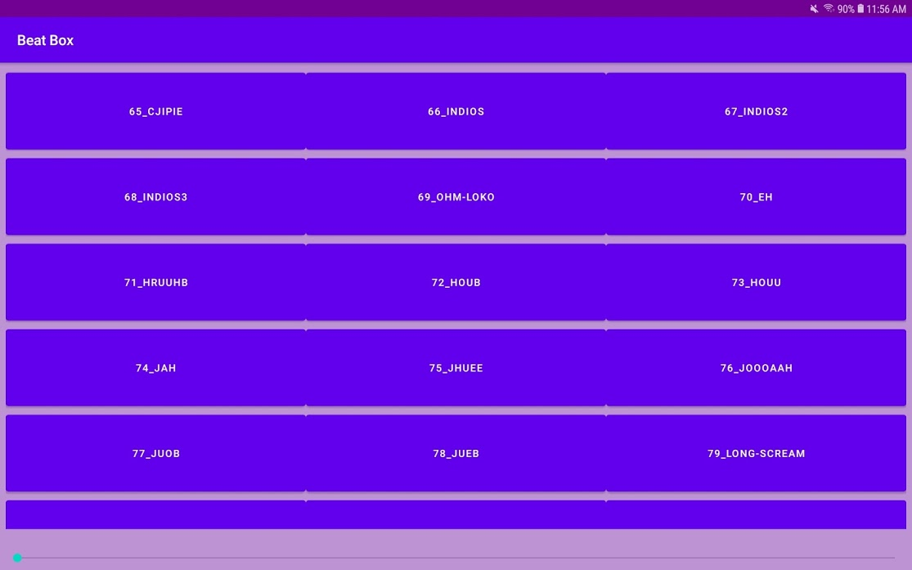
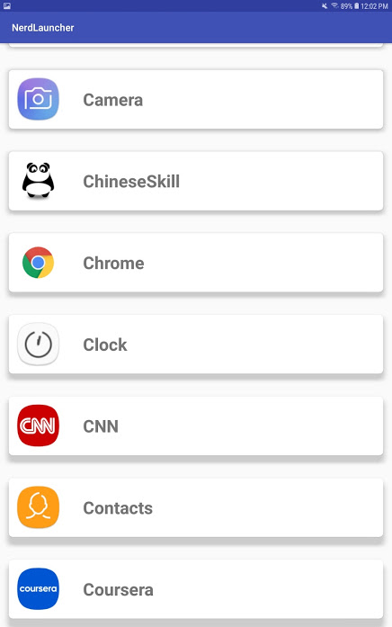
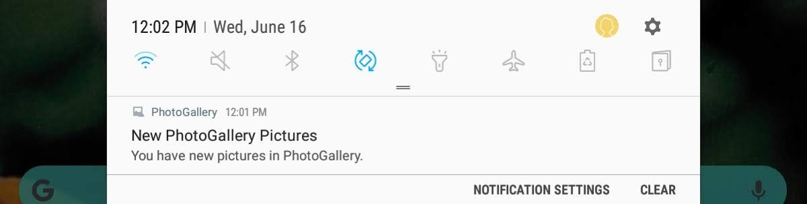
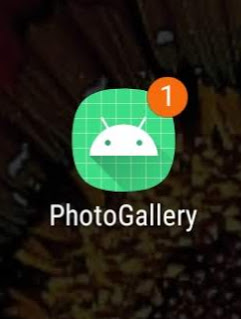
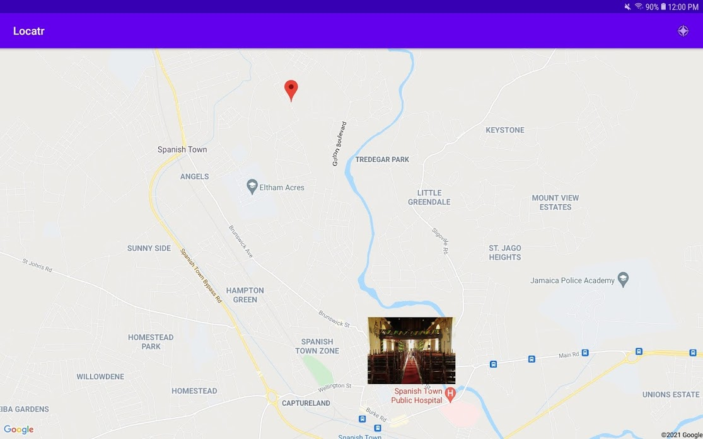

# Finished-Android-Projects

## BeatBox

Beatbox makes use of Android's AudioPlayback, where the user is able to play a sound associated with the button clicked. 



## Nerd Laucher

Launchers in Android allows the user to customize the home screen, launch apps and determin the overall look of the Android operating system. Nerd Launcher displays the a grid layout with a list of all the apps on the device.
For each application, the icon is seen beside the title of the app. While opening, a sound sound is played indicating the starting of the application.




## PhotoGallery

PhotoGallery is a client for photosharing using the site Flickr.  It fetches and display public photos uploaded from the photo-sharing site Flickr. 


By using a RecyclerView with a built in GridLayoutManager, it dislays recieved photos from the Flickr API and arranges them into a grid. 

In working with a background thread, by calling AsyncTask, a background thread is created that fetchs the post recent photos and searchs for photos related to the key word entered in the search bar 

```java
private class FetchItemsTask extends AsyncTask<Void,Void,List<GalleryItem>> {
        private String mQuery;

        public FetchItemsTask(String query) {
            mQuery = query;
        }
        @Override
        protected List<GalleryItem> doInBackground(Void... params) {

            if (mQuery == null) {
                return new FlickrFetchr().fetchRecentPhotos();
            } else {
                return new FlickrFetchr().searchPhotos(mQuery);
            }
        }

        @Override
        protected void onPostExecute(List<GalleryItem> items) {
            mItems = items;
            setupAdapter();
        }

    }


```

The service polls Flicker in the background and every ten minutes, once outside of the app, a notifiation is sent to the user that a new photo for a recent search has been found.

 ```java 
PollService.setServiceAlarm(getActivity(), shouldStartAlarm);
                getActivity().invalidateOptionsMenu();
```




Implementing WebView, when the user selects a photo, web content is displayed form Flickr's main website withing PhotoGallery. The content of the page comprises of teh picture selected andthe details surrounding the picture. 


## Locatr 

Locatr performs a Flickr geosearch thats asks the user for its current loction and displays pictures that would have been uploaded nearby the location of the user. It makes use of the Google API to view the Map.



## Tasks

The Tasks app fetches JSON data from the Tasks API created in our Web Development II course. It reads the JSON data and presents the tasks from the array in a ListView.  

In making the app most efficient, a singleton pattern was apllied which encapsulates RequestQueue and othe Volley Functionlity. 

```java 

public class MySingleton{

...

public RequestQueue getRequestQueue() {
        if (requestQueue == null) {
            // getApplicationContext() is key, it keeps you from leaking the
            // Activity or BroadcastReceiver if someone passes one in.
            requestQueue = Volley.newRequestQueue(ctx.getApplicationContext());
        }
        return requestQueue;
    }

...

}

```

Using a JsonObjectRequest for the Volley class, a request was made to retrive a task based on the task's ID, to then display in a listview 

```java 

public void getTaskbyId(String taskId, Volleyresponserlisterner volleyresponserlisterner){

       String url = TASKS_URL + taskId;

       List<TaskModel> taskModels = new ArrayList<>();

       JsonObjectRequest request = new JsonObjectRequest(Request.Method.GET, url, null, new Response.Listener<JSONObject>() {
           @Override
           public void onResponse(JSONObject response) {
               try{
                   JSONArray tasks = response.getJSONArray("tasks");

                    for(int i=0; i<tasks.length(); i++){
                        TaskModel allTasks = new TaskModel();
                        JSONObject first_task_from_api = (JSONObject) tasks.get(i);
                        allTasks.setId(first_task_from_api.getInt("id"));
                        allTasks.setTitle(first_task_from_api.getString("title"));
                        allTasks.setDescription(first_task_from_api.getString("description"));
                        allTasks.setDone(first_task_from_api.getBoolean("done"));
                        taskModels.add(allTasks);
                    }
                    volleyresponserlisterner.onResponse(taskModels);
               } catch ( JSONException e){
                   e.printStackTrace();
               }

           }

```

